<div align="center">

# 🚀 CDK TECK - Integrated AI & Multi-Cloud Solutions Ecosystem
### Architecting a portfolio of Cloud-Native and data-driven solutions.


**[Visit the CDK TECK Portfolio](https://www.cdkteck.com.br)**

</div>

---

## 🏛️ Architectural Vision

The **CDK TECK Hub** is more than just a portfolio; it's the gravitational center of an ecosystem of intelligent, independent applications. Designed with a **Multi-Cloud** philosophy, this hub, built on **Next.js**, serves as an interactive showcase and access point for a suite of solutions demonstrating expertise in AI Engineering, MLOps, DevOps, and Full-Stack development.

The architecture is conceived to be **modular and decoupled**, where each satellite project operates in its own repository and lifecycle, consuming a shared component library (`@cidqueiroz/cdkteck-ui`) to ensure visual consistency and accelerate development.

---

## Ecosystem Architecture Diagram

The diagram below illustrates the interaction between the central Hub, the satellite applications, the shared UI library, and the underlying cloud platforms.

```mermaid
graph TD
    subgraph "Cloud Platforms"
        OCI[Oracle Cloud Infrastructure]
        Firebase[Firebase Hosting]
        GCP[Google Cloud Platform]
    end

    subgraph "Satellite Applications"
        subgraph SenseiDB [SenseiDB-Agent]
            direction LR
            S_BE[Backend: Django] --> GCP
            S_FE[Frontend: Streamlit]
        end

        subgraph CacaPreco [PriceHunter]
            direction LR
            CP_BE[Backend: Django] --> OCI
            CP_FE[Frontend: React]
        end

        subgraph PapoDados [DataChat]
            direction LR
            PD_BE[Backend: Django] --> OCI
            PD_FE[Frontend: React]
        end

        subgraph GestaoRPD [RPDManagement]
            direction LR
            GRPD_BE[Backend: Django] --> OCI
            GRPD_FE[Frontend: React] --> Firebase
        end
    end

    subgraph "Core"
        UI_Lib["'@cidqueiroz/cdkteck-ui' 🎨"]
        Hub(CDK TECK HUB<br/>Next.js) --> Firebase
    end

    UI_Lib --> Hub
    UI_Lib --> CP_FE
    UI_lib --> PD_FE
    UI_Lib --> GRPD_FE

    Hub -- Accesses --> CacaPreco
    Hub -- Accesses --> PapoDados
    Hub -- Accesses --> GestaoRPD
    Hub -- Accesses --> SenseiDB

    style OCI fill:#c74634,stroke:#333,stroke-width:2px,color:#fff
    style GCP fill:#4285F4,stroke:#333,stroke-width:2px,color:#fff
    style Firebase fill:#FFCA28,stroke:#333,stroke-width:2px,color:#000
    style UI_Lib fill:#9448FF,stroke:#333,stroke-width:2px,color:#fff
```



---

## 🏗️ Architectural Pillars & Technologies

| Pillar | Description | Key Technologies |
| :--- | :--- | :--- |
| **Frontend Hub** | High-performance and SEO-optimized entry point, built with best web development practices. | Next.js, React, TypeScript, Tailwind CSS |
| **Unified UI/UX** | A private, versioned component library distributed via GitHub Packages to ensure visual consistency. | `@cidqueiroz/cdkteck-ui`, React, TypeScript |
| **Full-Stack Applications** | Complete business solutions with robust Django backends and reactive frontends. | Django, Django Rest Framework, React, Streamlit |
| **Infra as Code (IaC)** | Declarative and reproducible provisioning of all cloud infrastructure. | Terraform |
| **DevOps & CI/CD** | Full automation of build, test, versioning, and deployment for multiple cloud platforms. | GitHub Actions, Semantic Release, Docker |
| **Multi-Cloud** | Demonstration of competence in deploying and managing services across leading cloud providers. | OCI, GCP, Firebase |

---

## 💻 Showcased Projects

<details>
<summary><strong>PriceHunter</strong> - Marketplace with Competitor Monitoring</summary>
<br/>
A platform connecting buyers and sellers, offering sellers a scraping tool to monitor competitor prices and optimize their pricing strategy.
<ul>
  <li><strong>Backend:</strong> Django, Celery, Redis</li>
  <li><strong>Frontend:</strong> React.js</li>
  <li><strong>Infra:</strong> Oracle Cloud (OCI)</li>
  <li><strong>Repository:</strong> [CidQueiroz/Caca-Preco](https://github.com/CidQueiroz/Caca-Preco)</li>
</ul>
<br/>
</details>

<details>
<summary><strong>DataChat</strong> - Generative AI-powered BI SaaS</summary>
<br/>
A B2B solution allowing SMBs to upload spreadsheets and "chat with their data" in natural language to extract insights, using a RAG architecture on OCI.
<ul>
  <li><strong>Backend:</strong> Django, Pandas, LangChain</li>
  <li><strong>Frontend:</strong> React.js, Tailwind CSS</li>
  <li><strong>AI/DB:</strong> OCI Generative AI, Oracle Autonomous DB + Vector Search</li>
  <li><strong>Repository:</strong> [CidQueiroz/PapoDados](https://github.com/CidQueiroz/PapoDados)</li>
</ul>
<br/>
</details>

<details>
<summary><strong>RPDManagement</strong> - Personal Development Tool</summary>
<br/>
An application for personal and small business management, including tools like Dysfunctional Thought Record (DTR) and habit tracking, with a React frontend and Django backend.
<ul>
  <li><strong>Backend:</strong> Django</li>
  <li><strong>Frontend:</strong> React, Vite</li>
  <li><strong>Infra:</strong> OCI (Backend), Firebase (Frontend)</li>
  <li><strong>Repository:</strong> [CidQueiroz/GestaoRPD](https://github.com/CidQueiroz/GestaoRPD)</li>
</ul>
<br/>
</details>

<details>
<summary><strong>SenseiDB-Agent</strong> - Personal AI Agent</summary>
<br/>
An AI assistant using a RAG (Retrieval-Augmented Generation) architecture to provide personalized answers based on user contexts and documents, deployed on Google Cloud.
<ul>
  <li><strong>Backend:</strong> Django</li>
  - **Frontend:** Streamlit
  <li><strong>AI:</strong> Google AI (Gemini), Groq</li>
  <li><strong>Infra:</strong> Google Cloud Platform (GCP)</li>
  <li><strong>Repository:</strong> [CidQueiroz/SenseiDB-Agent](https://github.com/CidQueiroz/SenseiDB-Agent)</li>
</ul>
<br/>
</details>

---

## 🛠️ How to Run the Hub Locally

1.  **Clone the repository:**
    ```bash
    git clone https://github.com/CidQueiroz/cdkteck.git
    cd cdkteck
    ```

2.  **Configure `.npmrc`:**
    Create an `.npmrc` file in the root with the following content to access the UI library:
    ```
    @cidqueiroz:registry=https://npm.pkg.github.com
    ```

3.  **Install dependencies:**
    *Export your GitHub PAT before installing.*
    ```bash
    export NODE_AUTH_TOKEN="YOUR_PAT_WITH_READ_PACKAGES"
    npm install
    ```

4.  **Start the development server:**
    ```bash
    npm run dev
    ```
    Access [http://localhost:3000](http://localhost:3000) in your browser.

---

## 🚀 Deployment Automation (CI/CD)

This project utilizes **GitHub Actions** and **Semantic Release** for a fully automated deployment workflow:

1.  **Push to `main`:** A commit to the `main` branch (following [commit conventions](https://www.conventionalcommits.org/)) triggers the workflow.
2.  **Analysis & Versioning:** `semantic-release` analyzes commits, determines the next version, generates `CHANGELOG.md`, and creates a Git Tag.
3.  **Build:** The Next.js project is compiled for production.
4.  **Deploy:** The artifacts are deployed to **Firebase Hosting**.

---

## 👨‍💻 Author

<div align="center">
    
    <h3>Cidirclay Queiroz</h3>
    <p><strong>Senior AI Solutions Architect | MLOps Engineer | Multi-Cloud Specialist</strong></p>
    <p>Specialized in transforming complex business problems into scalable and resilient AI solutions in the cloud.</p>
    <p>
        <a href="https://www.linkedin.com/in/ciddy-queiroz/">LinkedIn</a> |
        <a href="https://www.cdkteck.com.br/">Website</a> |
        <a href="mailto:cydy.queiroz@cdkteck.com.br">Email</a>
    </p>
</div>

---

<div align="center">
  <sub>Crafted with 💡, ☕, and an ecosystem of cutting-edge technologies.</sub>
</div>
